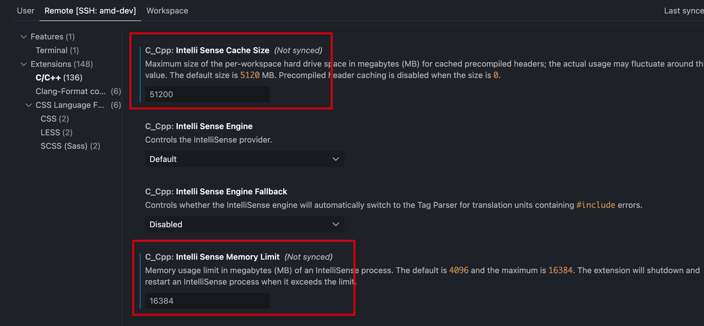

## dotfiles

### 从零搭建工作环境

* Macbook
  * 触控板：轻点

* 飞书、飞连

* 个人git仓库：

  * Dotfiles、CS-Notes

  * Dotfiles-local

    * 配置ssh + git账号
    * `git clone git@github.com:huangrt01/dotfiles-local.git`

  * ```shell
    git config --global user.name "huangrt01"
    git config --global user.email huangrt01@163.com
    
    # MacOs
    ssh-keygen -t rsa -b 4096 -C "huangrt01@163.com" # 如果rsa已占用，可用ssh-keygen -t ed25519 -C "huangruiteng@xxx.com"
    eval "$(ssh-agent -s)"
    ssh-add ~/.ssh/id_rsa --apple-use-keychain # MacOS带
    pbcopy < ~/.ssh/id_rsa.pub  # MacOS , Linux用xclip
    
    上github添加SSH Key
    
    ssh -T git@github.com
    # ssh-keygen -y -f ~/.ssh/id_rsa
    
    # Linux
    ```

* Iterm2、Sublime text
  * enter iTerm2/Settings
    * Profiles/Text/Font -> Meslo*
    * Profiles/Colors/ColorPresets -> Pastel*
  * Unlimited scroll back 

* Chrome

  * 账号

* Typora

  * 序列号

* VSCode、Trae、豆包、微信

* Mendeley
  * https://www.mendeley.com/download-reference-manager/macOS

* QuickJump


* 暂时搁置

  * [hammerspoon](https://github.com/Hammerspoon/hammerspoon)

  * [Karabiner-Elements](https://karabiner-elements.pqrs.org/)

### dotfile

* my dotfiles, the design philosophy is illustrated in my [Shell Note](https://github.com/huangrt01/CS-Notes/blob/master/Notes/Output/Shell-MIT-6-NULL.md)
* easy-to-use
```shell
chmod 777 bootstrap.sh
./bootstrap.sh
zsh
```

#### submodules
* zsh plugins: [zplug](https://github.com/zplug/zplug), [fzf](https://github.com/junegunn/fzf), [autojump](https://github.com/wting/autojump.git), [zsh-completions](https://github.com/zsh-users/zsh-completions), [zsh-autosuggestions](https://github.com/zsh-users/zsh-autosuggestions), [zsh-syntax-highlighting](https://github.com/zsh-users/zsh-syntax-highlighting), [zsh-history-substring-search](https://github.com/zsh-users/zsh-history-substring-search), [zsh-git-prompt](https://github.com/olivierverdier/zsh-git-prompt)
* vim plugins：[ack.vim](https://github.com/mileszs/ack.vim), [ctrlp.vim](https://github.com/ctrlpvim/ctrlp.vim), [nerdtree](https://github.com/preservim/nerdtree), [vim-fugitive](https://github.com/tpope/vim-fugitive), [vim-rhubarb](https://github.com/tpope/vim-rhubarb), [ale](https://github.com/dense-analysis/ales)
* `shallow=true'

#### local customization
* shell
```shell
if [ -f ~/.zshrc_local ]; then
    source ~/.zshrc_local
fi
```

* git
```shell
[include]
        path = ~/.gitconfig_local
```
* vim
```shell
let $LOCALFILE=expand("~/.vimrc_local")
if filereadable($LOCALFILE)
    source $LOCALFILE
endif
```
* tmux
```shell
if-shell "[ -f ~/.tmux_local.conf ]" 'source ~/.tmux_local.conf'
```

#### Manually install

* vim-ale related: [shellcheck](https://github.com/koalaman/shellcheck), [write-good](https://github.com/btford/write-good)(or [proselint](http://proselint.com/) )

```shell
brew/apt install shellcheck
npm install -g write-good
```

* MailMaster, WeChat
* [tldr](https://tldr.sh/), fd, rg, [mosh](https://mosh.org/#getting), [tree](http://mama.indstate.edu/users/ice/tree/), ag

```shell
# apt install silversearcher-ag
git clone https://github.com/satanson/the_silver_searcher.git --depth=1
sudo apt install -y automake pkg-config libpcre3-dev zlib1g-dev liblzma-dev
./build.sh
sudo make install

apt install tree

# https://nodejs.org/en/download/package-manager/#installing-node-js-via-package-manager
npm install -g tldr

apt install fd-find
apt install cloc
```

* [hub](https://github.com/github/hub)([usage](https://hub.github.com/#developer)), tig
* [Valgrind](https://valgrind.org/), Perf, stress, [rr](https://rr-project.org/), htop

```shell
sudo apt-get update
sudo apt install zsh
zsh --version

# log out and login back
echo $SHELL
$SHELL --version

sh -c "$(curl -fsSL https://raw.githubusercontent.com/ohmyzsh/ohmyzsh/master/tools/install.sh)"

sudo apt-get install python3-pip
pip install --upgrade pip
pip install --upgrade setuptools
pip install ipython
pip install ipdb
pip3 install thefuck

pip install -i https://pypi.tuna.tsinghua.edu.cn/simple virtualenvwrapper
export WORKON_HOME=~/Envs
mkdir -p $WORKON_HOME
source /usr/local/bin/virtualenvwrapper.sh
# or
source ~/.local/bin/virtualenvwrapper.sh

# install perf
sudo apt install linux-source
cd /usr/src
tar -xjf linux-source-4.4.0.tar.bz2
cd tools/perf
make # fail! why?
sudo apt install linux-tools-common

perf
# ...
# follow the instructions
# ...
# finish installing perf

apt install stress
apt install htop
```

* python3, pip3, ipython, ipdb, [line_profiler](https://github.com/pyutils/line_profiler), [memory-profiler](https://pypi.org/project/memory-profiler/), [pycallgraph](http://pycallgraph.slowchop.com/en/master/)
```
pip install memory-profiler
pip install line_profiler
pip install pycallgraph
apt/brew install graphviz
# dot -v
```

**Security**:

* [gpg](https://www.digitalocean.com/community/tutorials/how-to-use-gpg-to-encrypt-and-sign-messages), [haveged](https://www.digitalocean.com/community/tutorials/how-to-setup-additional-entropy-for-cloud-servers-using-haveged)

```sh
brew install gnupg
```

**Firefox Add-on**

* HTTPS Everywhere, Multi-Account Containers(No Chrome), [uBlock Origin](https://github.com/gorhill/uBlock), 1Password

* [stylus](https://github.com/openstyles/stylus/)
* Full Web Page Screenshots (Chrome: Full Page Screen Capture


### Linux

```
sudo apt-get update
sudo apt-get install manpages-dev
sudo apt-get install gdb
```

### Macbook

* 自动化：
  * 安装brew
  * 下载安装powerline font

### VSCode

#### 开发必备插件

* 公共: 
  * Python
  * Remote - SSH
  * **ByteDance Authenticator**
  * MarsCode
  * GitLens
  * Code Spell Checker, EditorConfig for VSCode, String Manipulation, Visual Studio IntelliCode
  * Code Runner
* Python:
  * Python
  * yapf
    * 添加settings.json
* C++: [cpplint](https://github.com/cpplint/cpplint), CodeLLDB, Header source switch, Rainbow Brackets, C++ Intellisense
  * CMake, CMake Tools
    * cmake插件需要cmake3.9.4以上版本的cmake的支持，ubuntu16.04以下的用户可能需要手动安装新版本的cmake
  * Clangd
    * [VSCode C/C++ 开发环境和调试配置：Clangd+Codelldb](https://zhangjk98.xyz/vscode-c-and-cpp-develop-and-debug-setting/)
      * 阅读超大型项目源码的注意事项
        * 关闭 editor.formatOnSave, clang-tidy, all-scopes-completion
        * codeLLDB 使用（TODO）

    * 有clangd之后，不需要 C/C++ (by Microsoft) 了

  * Tabnine：AI加持的自动补全，用GPT
  * Peacock：不同workspace可以用不同的颜色区分
  * 调大C++插件的可用内存：
    * 
  * [如何优雅的用 VScode 编写 C++ 大型项目？](https://www.zhihu.com/question/353722203/answer/2564104885)
    * lsp(language service provider): vscode clangd
    * 依赖 compile_commands.json
      * 自动构建
      * 手动生成：`mkdir build && cd build && cmake -DCMAKE_EXPORT_COMPILE_COMMANDS=1 ..`
    * 如果linux的glibc版本较旧，需要给clangd打补丁（patchelf），链接向新版glibc
